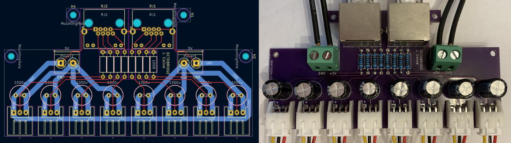
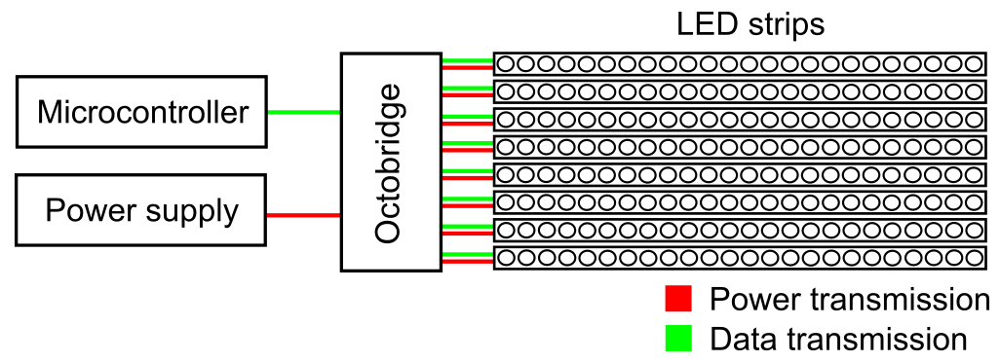
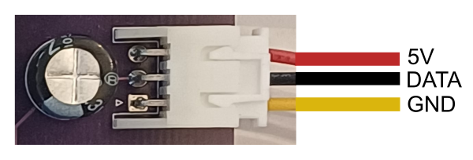
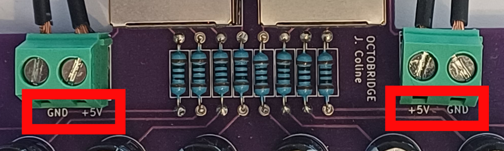
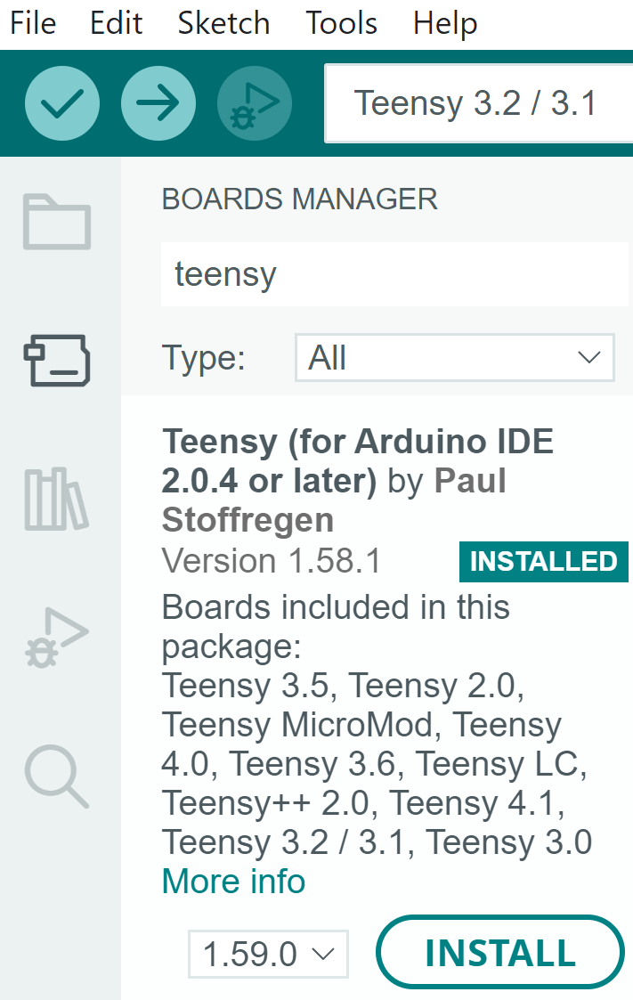

<!--
*** Thank you : https://github.com/othneildrew/Best-README-Template/blob/master/BLANK_README.md
-->

<!-- PROJECT SHIELDS -->
<!--
*** I'm using markdown "reference style" links for readability.
*** Reference links are enclosed in brackets [ ] instead of parentheses ( ).
*** See the bottom of this document for the declaration of the reference variables
*** for contributors-url, forks-url, etc. This is an optional, concise syntax you may use.
*** https://www.markdownguide.org/basic-syntax/#reference-style-links
-->
[![Contributors][contributors-shield]][contributors-url]
[![Forks][forks-shield]][forks-url]
[![Stargazers][stars-shield]][stars-url]
[![Issues][issues-shield]][issues-url]
[![MIT License][license-shield]][license-url]
[![LinkedIn][linkedin-shield]][linkedin-url]

<!-- PROJECT LOGO -->
<br />
<p align="center">
  <a href="https://github.com/JoachimColine/Octobridge">
    
  </a>
  <a href="https://github.com/JoachimColine/Octobridge">
	
  </a>
  <a href="https://github.com/JoachimColine/Octobridge">
	
  </a>

  <h3 align="center">Easy LED Panel</h3>

  <p align="center">
    Assemble, program and simulate up to 8 LED strips driven by a <a href= "https://www.pjrc.com/store/octo28_adaptor.html">Teensy</a> board
    <br />
    <a href="https://www.youtube.com/watch?v=32DB5OOd8oo&ab_channel=JoachimColine">View Demo</a>
    ·
    <a href="https://github.com/JoachimColine/Octobridge/issues">Report Bug</a>
    ·
    <a href="https://github.com/JoachimColine/Octobridge/issues">Request Feature</a>
  </p>
</p>

<!-- ABOUT THE PROJECT -->
## What is it?

This repository aims to
- provide [guidelines](#how-to-build-your-own-led-panel) for assembling and programming a simple LED panel using LED strips,
- give public access to the [PCB files](/kicad) of a component (the _Octobridge_),
- provide a way to [simulate](#how-to-simulate-your-own-led-panel) your LED panel on your computer, allowing easy tests without hardware,
- suggest some program snippets that can be directly uploaded to your LED panel. (TBD)

I had the chance to put this project to practice with my <a href= "https://www.touchouss.lol/">improv team</a>. By aligning 8 strips of 150 LEDs and with a little programming, we put on a great show!  :sunglasses:

<p align="center">

</p>

## How to build your own LED panel
### Caution
- LED strips can be dangerous for the human eye, as they produce very bright light. Be careful. Place a diffusing material in front of the LEDs to attenuate the light.
- LED strips draw a lot of power. Be careful. Incorrect or unsafe wiring can be dangerous.

### Working principle
A Teensy-driven LED panel is made up of 3 main parts:
- Power supply, needed for producing light,
- a microcontroller, needed for controlling the RGB values of each LED,
- WS2811b LED strips aligned on top of one another, needed for creating a 2D grid of LEDs. 

To make the bridge between these parts, and to facilitate cable work, I designed a printed circuit board I called the Octobridge. As shown in the simplified illustration below, the Octobridge receives power and data, and distributes it to the LED strips. 

<p align="center">

</p>

In practice, the power received comes from a 5V DC power supply, and data comes from a <a href= "https://www.pjrc.com/store/octo28_adaptor.html">Teensy</a> board using two CAT6 Ethernet cables. 
This is shown in the illustration below.

<p align="center">

</p>

The top four LED strips are powered by the top power input and driven by the top CAT6 Ethernet cable.
The bottom four LED strips are powered by the bottom power input and driven by the bottom CAT6 Ethernet cable.

The data sent to the WS2811b chips consists of a series of digital pulses, with each pulse representing a bit of information. 
The timing and sequence of these pulses encode the color and brightness data for each LED.
Each LED interprets the data intended for it and adjusts its color and brightness accordingly. 

By being individually addressable, the WS2811b LEDs can be programmed with high flexibility. 
Programming is particularly easy under the <a href="https://www.arduino.cc/">Arduino</a> framework as explained in the [LED programming section](#how-to-program-your-own-led-panel).

### List of required components
- A <a href= "https://www.pjrc.com/store/octo28_adaptor.html">Teensy</a> board, mounted on an OctoWS2811 Adaptor,
- two CAT6 Ethernet cables,
- a 5V DC power supply (that can draw up to 40A),
- thick wires for connecting the power supply to the Octobridge (the thicker, the better. Too thin wires will burn or cause incorrect LED colors),  
- WS2811b LED strips,
- an Octobridge (the PCB files can be found [here](/kicad)),
- passive components to be soldered on the Octobridge, that is
    - eight 100ohm resistors,
	- eight 1000µF capacitors (6.3V, 3.5mm lead spacing),
	- two single-port, tab-up (not down!) RJ45 connectors (through-hole, 8P8C, shielded, right-angle),
	- eight S3B-XH-A JST connectors,
	- eight JST XH 2.54mm 3-pin wired connectors.

### Step-by-step assembly
- Make sure you have [all the components needed](#list-of-required-components). They can be ordered from the following suppliers:
	- <a href= "https://www.pjrc.com/store/octo28_adaptor.html">PJRC</a>: for the Teensy board,
	- <a href= "https://jlcpcb.com/">JLCPCB</a>: for the Octobridge (the PCB files can be found [here](/kicad)),	
	- Amazon, Aliexpress, etc.: for the rest.
- Once you have gathered all the components,
	- solder the passive components on the Octobridge (watch out for the polarity of your capacitors!),
	- solder the JST XH 2.54mm 3-pin wired connectors to your LED strips (make sure the pin mapping is respected. Refer to the [wiring circuit](/kicad/octobridge.pdf) or to the image below),
	<p align="center">
	
	</p>
	
	- turn off the power supply and wire it to the Octobridge (watch out for the right GND and 5V connections, as shown in the image below),
	<p align="center">
	
	</p>
	
	- connect your LED strips and your Teensy board to the Octobridge.
	
We're all set! 

## How to program your own LED panel
The last part of the project is also the most fun: you get to program your own LED animations :sunglasses:.

- Install and run the <a href="https://www.arduino.cc/">Arduino</a> IDE on your computer,
- from the Arduino main window, go to the _Boards Manager_ and install the <a href="https://www.pjrc.com/teensy/td_download.html">Teensy</a> extension by Paul Stoffregen (as shown in the image below),
<p align="center">

</p>

### Your first LED animation
- go to _Manage Libraries ..._ under the _Tools_ menu, and install the <a href="https://fastled.io/">FastLED</a> and the <a href="https://www.pjrc.com/teensy/td_libs_OctoWS2811.html">OctoWS2811</a> libraries,
- open your first LED animation file by going to _File_&rarr;_Examples_&rarr;_OctoWS2811_&rarr;_BasicTest_FastLED_.
- in the code, edit the value of `NUM_LEDS` to your total number of LEDs.

Finally, plug your Teensy to your computer, upload the sketch, and power up the Octobridge (after checking the wiring). Congratulations, you just brought life to your LED panel! :rocket:

### Programming custom animations
You can create your own animations using the <a href="https://fastled.io/">FastLED</a> and/or the <a href="https://www.pjrc.com/teensy/td_libs_OctoWS2811.html">OctoWS2811</a> libraries. Possibilities are endless! Have fun :grinning:

## How to simulate your own LED panel
Want to test an idea without wiring up hardware? You have come to the right place! 

I have made available a [Python script](/simulator/simulator.py) that simulates an LED panel. 
The downside of this simulator is that it is not using Arduino, which means you will have to re-write the program if you want to upload it to your <a href="https://www.pjrc.com/store/octo28_adaptor.html">Teensy</a>  board. 
However,
- Python is awesome (change my mind),
- you can test your ideas quickly and easily without hardware, 
- resulting animations can be easily visualized and shared,
- programming simulated animations is very similar to programming in Arduino.

### Requirements
You will need to install <a href="https://www.python.org/downloads/">Python</a> by downloading and running their latest installer. See <a href="https://github.com/PackeTsar/Install-Python/blob/master/README.md">this repository</a> for a complete tutorial for installing Python on common operating systems.
The simulator depends on <a href="https://www.pygame.org/wiki/GettingStarted">Pygame</a> which you also need to install.

### Your first simulation
Once you have installed [all requirements](#requirements), run the [animation example](/simulator/animationExample.py) script with the command
```
python animationExample.py
```
from the terminal. A window will pop, displaying the following LED animation: 

<p align="center">
  <a href="https://github.com/JoachimColine/Octobridge">
	
  </a>
</p>


Congratulations, you just brought life to your simulated LED panel! :rocket:
### Programming custom simulated animations
You can create your own animations using the simulator. I would recommend doing so in a new Python script of your own in the [simulator](/simulator) directory. A great way to start would be to copy the [animation example](/simulator/animationExample.py) and edit it in a new file.

<!-- MARKDOWN LINKS & IMAGES -->
<!-- https://www.markdownguide.org/basic-syntax/#reference-style-links -->
[contributors-shield]: https://img.shields.io/github/contributors/JoachimColine/Octobridge.svg?style=flat-square
[contributors-url]: https://github.com/JoachimColine/Octobridge/graphs/contributors
[forks-shield]: https://img.shields.io/github/forks/JoachimColine/Octobridge.svg?style=flat-square
[forks-url]: https://github.com/JoachimColine/Octobridge/network/members
[stars-shield]: https://img.shields.io/github/stars/JoachimColine/Octobridge.svg?style=flat-square
[stars-url]: https://github.com/JoachimColine/Octobridge/stargazers
[issues-shield]: https://img.shields.io/github/issues/JoachimColine/Octobridge.svg?style=flat-square
[issues-url]: https://github.com/JoachimColine/Octobridge/issues
[license-shield]: https://img.shields.io/github/license/JoachimColine/Octobridge.svg?style=flat-square
[license-url]: https://github.com/JoachimColine/Octobridge/blob/master/LICENSE
[linkedin-shield]: https://img.shields.io/badge/-LinkedIn-black.svg?style=flat-square&logo=linkedin&colorB=555
[linkedin-url]: https://linkedin.com/in/joachim-coline
